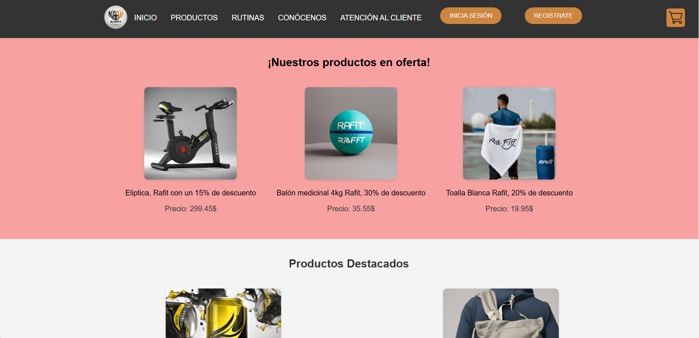
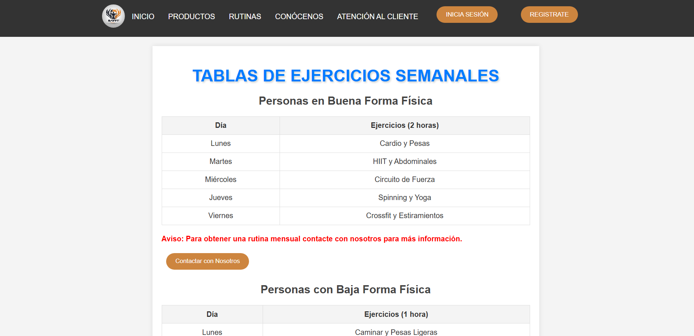

# RAFIT

| 🇪🇸 | RAFIT es un projecto html estático creado como un ejercicio práctico en 2023 para simular un entorno de desarrollo de una aplicación web real, en equipo y usando metodologías ágiles como SCRUM.

| 🇬🇧 | RAFIT is an static html project created as practical exercise in 2023 to simulate a real web development app environment, on a team and using agile metodologies as SCRUM.
## Authors

- [@SoyaR08](https://www.github.com/soyar08)
- [@Adrian140604](https://www.github.com/adrian140604)
- [@Antonio1004](https://www.github.com/antonio1004)
- [@Hugoorgaz](https://www.github.com/hugoorgaz)
- [@Javier2207](https://www.github.com/javier2207)

## Screenshots






## Project Structure
```
    /
    ├── CSS
    │   ├── Bienvenida.css
    │   ├── Contactanos.css
    │   ├── Correcto.css
    │   ├── Css_index.css
    │   ├── ERP.css
    │   ├── Eliptica_Rafit.css
    │   ├── IniciaSesion.css
    │   ├── Politica_cookies.css
    │   ├── ProductosPagina.css
    │   ├── RSS.css
    │   ├── Registro.css
    │   ├── Rutinas.css
    │   ├── acliente.css
    │   ├── avisolegal.css
    │   ├── carrito.css
    │   ├── pagocorrecto.css
    │   ├── producto.css
    │   └── registro_correcto.css
    ├── Documentos => Docs created before coding
    ├── HTML
    │   ├── Bienvenida.html
    │   ├── Contactanos.html
    │   ├── Correcto.html
    │   ├── ERP.html
    │   ├── IniciaSesion.html
    │   ├── Politica_cookies.html
    │   ├── ProductoBalon.html
    │   ├── ProductoBebida.html
    │   ├── ProductoBotella.html
    │   ├── ProductoEliptica.html
    │   ├── ProductoEsterilla.html
    │   ├── ProductoMochila.html
    │   ├── ProductoPesas.html
    │   ├── ProductoToalla.html
    │   ├── Productos.html
    │   ├── RSS.html
    │   ├── Registro.html
    │   ├── Rutinas.html
    │   ├── acliente.html
    │   ├── avisolegal.html
    │   ├── añadido_correcto.html
    │   ├── carrito.html
    │   ├── pagocorrectro.html
    │   └── registro_correcto.html
    ├── IMAGENES => Not necessary to show
    ├── JS
    │   ├── ProductoBalon.js
    │   ├── ProductoBebida.js
    │   ├── ProductoBotella.js
    │   ├── ProductoEliptica.js
    │   ├── ProductoEsterilla.js
    │   ├── ProductoMochila.js
    │   ├── ProductoPesas.js
    │   ├── ProductoToalla.js
    │   ├── ValidaFormularioAtencionAlCliente.js
    │   ├── ValidaFormularioIniciaSesion.js
    │   ├── ValidaFormularioRegistro.js
    │   ├── añadir_correcto.js
    │   ├── carrito.js
    │   └── carrusel.js
    ├── README.md
    └── index.html
```
